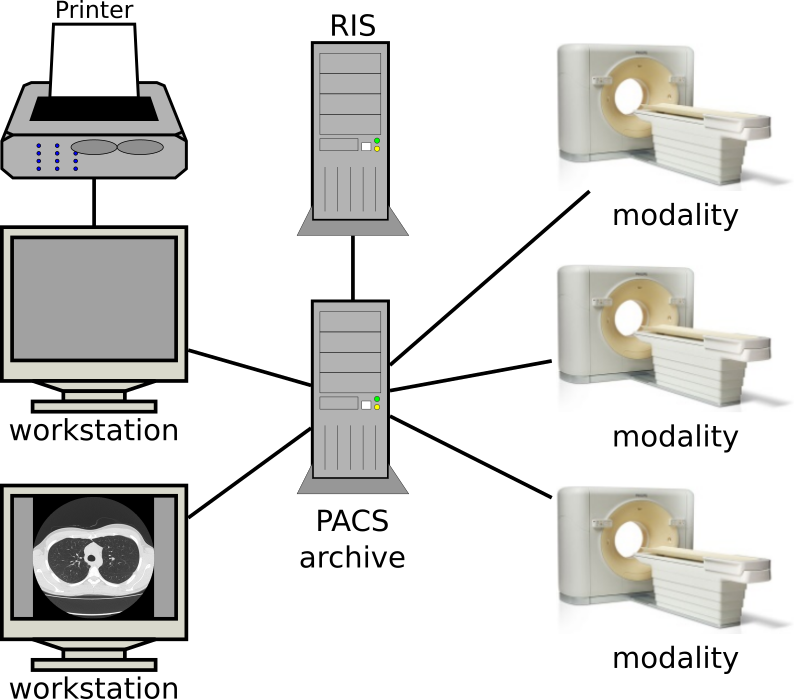
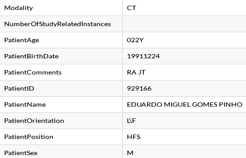
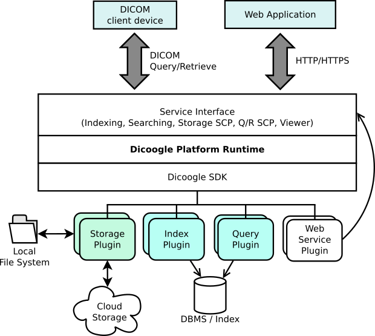
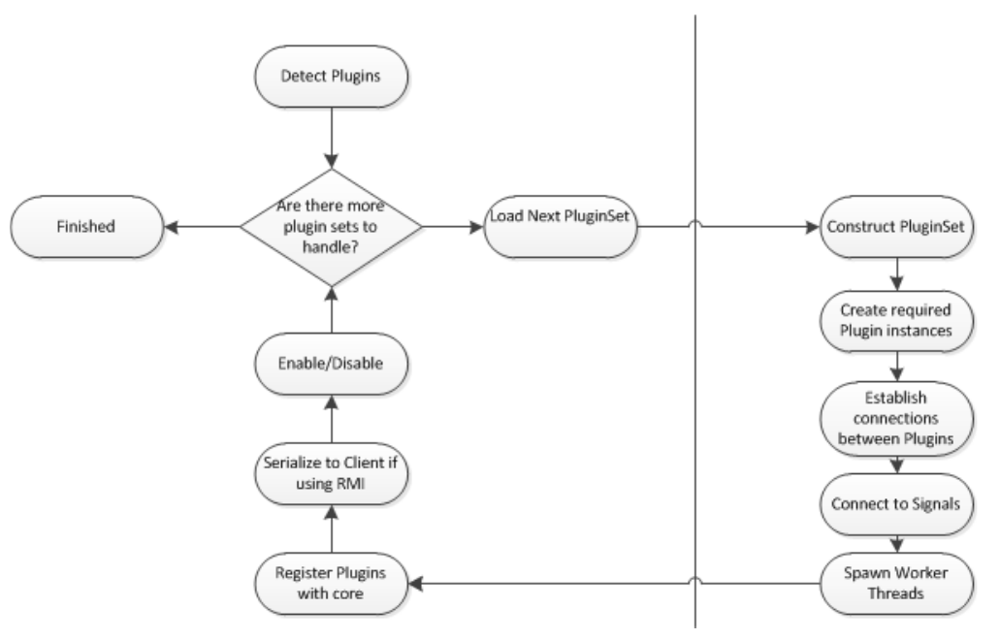
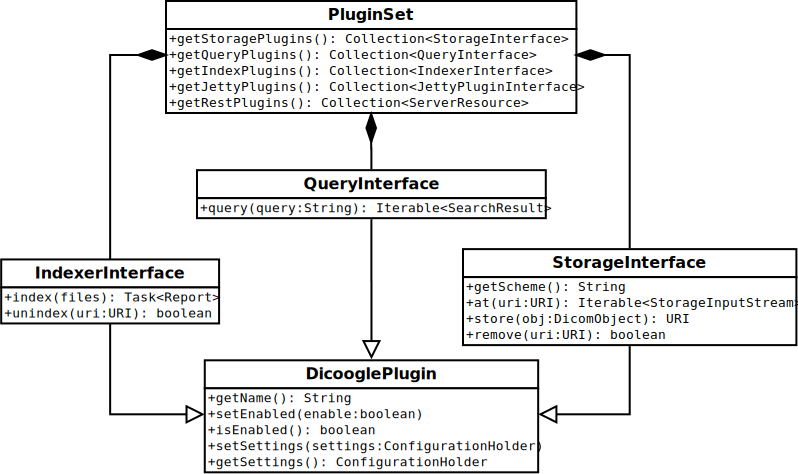

class: center, middle
background-color: #cbe0f2

  

# 

## An Introduction

   
   

 .footnote[.right[Eduardo Pinho &nbsp; <eduardopinho@bmd-software.com>]]
.footnote[.right[Rui Lebre &nbsp; <ruilebre@ua.pt>]]

---

# Index

1. Introduction & Motivation
2. Dicoogle
   - Features & Architecture
   - Resources
3. Using Dicoogle
   - Deploying
   - Basic Usage
4. Developing for Dicoogle

---

# Introduction

- The increasing investments in information technologies have led to improvements and methodologies to assess:
  - Performance, efficiency, quality of service.

- Picture Archiving and Communication Systems (PACS)

.center[]

---

# Introduction

- File-based repositories rely on the _DICOM_ standard for image storage and communication in a PACS.
--

- Multiple forms of information exist.
   - Meta-data: information related to the examination, the patient's demographics, clinical staff, acquisition device, etc.
   - Image data: image or video, often of unconventional bit depths and resolutions.
   - Medical reports: can be structured or unstructured.

.center[
  
&nbsp; &nbsp;
  
&nbsp; &nbsp;
  
]
---

# Introduction

- The requirements of medical imaging systems are ever increasing.
  - Imaging data output becomes larger and more frequent (Big Data).
  - New and enhanced modalities are emerging (whole-slide microscopy, PET/MRI, ...).
- Information retrieval is important
  - Improved radiology workflows, teaching, researching.
  - New ways to search over medical imaging data.
--

- The great majority of installed information system do not allow such kind of analysis (limited indexing capabilities).
- Few systems enable institutions to continuously monitor and measure the efficiency of medical imaging data produced.
- DICOM compliance is insufficient for state-of-the-art retrieval capabilities (free text search, query-by-example, ...).

---

# Motivation

- Secondary use of DICOM meta-data.
- Evaluate and integrate developed tools in multiple case studies.
   - Database technologies (SQL, NoSQL, ...);
   - Image recognition (computer-assisted detection, content-based image retrieval, ...);
- Knowledge extraction.
   - Obtain healthcare quality indicators.
   - Analyses of the workflow and productivity.

---

# .center[]

- Extensible, platform-independent, open-source PACS archive;
- Designed to embrace advanced indexing mechanisms and knowledge extraction from medical imaging information;
- Over 25 million images were indexed in Aveiro, Portugal;
- Has fulfilled a multitude of use cases in research and industry.

--

### The user can:

- Index DICOM files
- Quick DIM navigation
- Navigate over meta-data
- Free text searching
- Perform advanced boolean queries
- Export data to CSV

---

# 

.exhibit-text-left[
- Plugin-based architecture
  - Empower a PACS archive with additional features
  - High-level abstractions from DICOM services and resources
  - Easy to interact with core functionalities
  - _Dicoogle SDK_
- Built-in DICOM QR + Storage
- Web service driven
  - configuration and interaction
- Web user interface
  - single-page webapp
- Open-source (GPL 3.0)
]

---

# Resources

- **Official Website**: [www.dicoogle.com](http://www.dicoogle.com) 
- **<i class="fa fa-github fa-lg"></i> View on GitHub**: [github.com/bioinformatics-ua/dicoogle](https://github.com/bioinformatics-ua/dicoogle)
- **Learning Pack**: [bioinformatics-ua.github.io/dicoogle-learning-pack](https://bioinformatics-ua.github.io/dicoogle-learning-pack)

Want to try it now? We have a [live demo](http://demo.dicoogle.com) (http://demo.dicoogle.com) !

---

# Getting Started

- Start by [downloading](http://www.dicoogle.com/downloads/) Dicoogle and base plugins.
   
- Requires Java 7 (Java 8 recommended).

--

- Extract the zip file to a new folder (e.g. _"DicoogleDir"_).
- The folder shall contain 6 files and 1 folder:
   - DicoogleClient.bat
   - DicoogleServer.bat
   - DicoogleClient.sh
   - DicoogleServer.sh
   - dicoogle.jar
   - README.md
   - Plugins
- On your terminal, run `DicoogleClient.bat` if you are a Windows user, or `DicoogleClient.sh` if you are Linux/MacOS user
- The [Setup](https://bioinformatics-ua.github.io/dicoogle-learning-pack/docs/setup) page of the Learning Pack will guide you with further detail.

---

# Using Dicoogle

Enter the webapp: <http://localhost:8080>

.center[
username: `dicoogle`   password: `dicoogle`
]

---

# Using Dicoogle

- Grab a DICOM data set.

--

- Force Dicoogle to index the set.

</img>

---

# Using Dicoogle

---

# Need Help?

#### 1. Is something unclear or missing in the Learning Pack?

[Create an issue](https://github.com/bioinformatics-ua/dicoogle-learning-pack/issues/new) at the learning pack repository.

--

#### 2. Found a bug in Dicoogle?

[File an issue](https://github.com/bioinformatics-ua/dicoogle/issues/new) at the main Dicoogle repository.

--

#### 3. Other issues?

Contact the Maintainers:

- Luís Bastião Silva <bastiao@bmd-software.com> (development leader)
- Eduardo Pinho <eduardopinho@ua.pt>
- Rui Lebre <ruilebre@ua.pt>

--

#### 4. Professional Assistance?

Please contact [BMD Software](https://www.bmd-software.com).

---

class: center, middle
background-color: #cbe0f2

  

# 

## Developing for Dicoogle

  

---

# Core Architecture

</img>

---

# Plugin-based Development

.col-2[A plugin is:

- An extension to Dicoogle.
- Developed and bundled separately.
- Loaded at Dicoogle runtime.
- A set of components implementing common APIs
]

</img>

---

# Dicoogle SDK

 - Defines common APIs (Storage, Query, Index, ...).
 - Provides additional data structures and libraries.
--

 - `PluginSet` contains a set of these plugins.

</img>

--

Web UI plugins are different ([read more](https://bioinformatics-ua.github.io/dicoogle-learning-pack/docs/webplugins))

---

# Dicoogle Plugin Types

- **Storage**: provide access to persistent file/blob storages.

- **Indexer**: implement data indexing for efficient searching

- **Query**: enable search through indexed content

- **Servlet** (Jetty): web services implemented with servlets.

- **RESTlet**: web services implemented using RESTlet server resources.

--

- **~~Graphical~~**: obsolete

- **Web UI**: Implemented in JavaScript; extend the web user interface.

---

# Creating a Plugin

- Create a `PluginSet` implementation and build a jar.

----

- Grab our sample: [github.com/bioinformatics-ua/dicoogle-plugin-sample](https://github.com/bioinformatics-ua/dicoogle-plugin-sample)
--

- Inspect the project's sources.
  - Where is the plugin set?
  - What APIs do the plugins implement, and which methods?

--
- Build and test them on Dicoogle.
- You can start your own plugins from this one.

---

# Our Developers

.block-division-2-3[
### Maintainers

- Luís Bastião ─ <bastiao@bmd-software.com>
 - Eduardo Pinho ─ <eduardopinho@bmd-software.com>
- Rui Lebre ─ <ruilebre@ua.pt>

### Current Contributors

- Jorge Silva

### R&D Project Managers

- Carlos Costa
- José Luís Oliveira

]

.block-division-3[
### Past Contributors

- Carlos Ferreira
- David Campos
- Eriksson Monteiro
- Frederico Silva
- Frederico Valente
- Leonardo Oliveira
- Luis Ribeiro
- Renato Pinho
- Samuel Campos
- Tiago Godinho
- and many others...

]

--

**<i class="fa fa-github fa-lg"></i> You can be a contributor! [github.com/bioinformatics-ua/dicoogle](https://github.com/bioinformatics-ua/dicoogle)**
