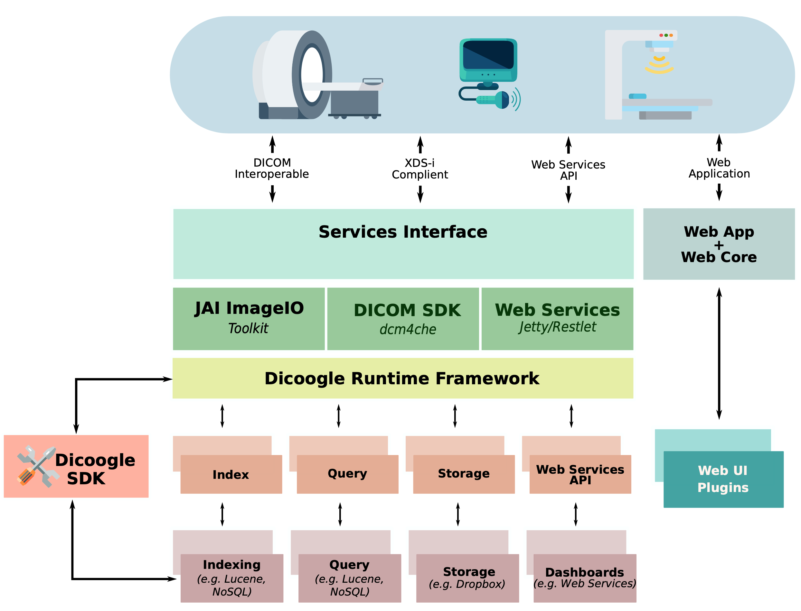

class: center, middle
background-color: #cbe0f2

# 

## An Introduction

.footnote[.right[Eduardo Pinho &nbsp; <eduardopinho@ua.pt>]]

---

# Index

1. Introduction & Motivation
2. Dicoogle
   - Features & Architecture
   - Resources
3. Using Dicoogle
   - Deploying
   - Basic Usage

---

# Introduction

- The increasing investments in information technologies have led to improvements and methodologies to assess:
  - Performance, efficiency, quality of service.

- Picture Archiving and Communication Systems (PACS)

.center[]

---

# Introduction

- File-based repositories rely on the _DICOM_ standard for image storage and communication in a PACS.
--

- Multiple forms of information exist.
   - Meta-data: information related to the examination, the patient's demographics, clinical staff, acquisition device, etc.
   - Image data: image or video, often of unconventional bit depths and resolutions (e.g. 16-bit grayscale in CT)
   - Medical reports: can be structured or unstructured; 

.center[
  
&nbsp; &nbsp;
  
&nbsp; &nbsp;
  
]
---

# Introduction

- The requirements of medical imaging systems are ever increasing.
  - Imaging data output becomes larger and more frequent (Big Data).
  - New and enhanced modalities are emerging (whole-slide microscopy, PET/MRI, ...).
- Information retrieval is important
  - Improved radiology workflows, teaching, researching.
  - New ways to search over medical imaging data.
--

- The great majority of installed information system do not allow such kind of analysis (limited indexing capabilities).
- Few systems enable institutions to continuously monitor and measure the efficiency of medical imaging data produced.
- DICOM compliance is insufficient for state-of-the-art retrieval capabilities (free text search, query-by-example, ...).

---

# Motivation

- Secondary use of DICOM meta-data.
- Evaluate and integrate developed tools in multiple case studies.
   - Database technologies (SQL, NoSQL, ...);
   - Image recognition (computer-assisted detection, content-based image retrieval, ...);
- Knowledge extraction.
   - Obtain healthcare quality indicators.
   - Analyses of the workflow and productivity.

---

# .center[]

- Extensible, platform-independent, open-source PACS archive;
- Designed to embrace advanced indexing mechanisms and knowledge extraction from medical imaging information;
- Over 25 million images were indexed in Aveiro, Portugal;
- Has fulfilled a multitude of use cases in research and industry.

---

# 

.exhibit-text-left[
- Plugin-based architecture
  - Plugins are developed separately
  - _Dicoogle SDK_
- Plugin-based architecture
- Built-in DICOM QR + Storage
- Web service driven
  - configuration and interaction
- Web user interface
  - single-page webapp
- Open-source
  - GPL 3.0
]

---

# Need Help?

#### 1. Is something unclear or missing in the Learning Pack?

[Create an issue](https://github.com/bioinformatics-ua/dicoogle-learning-pack/issues/new) at the learning pack repository.

--

#### 2. Found a bug in Dicoogle?

[File an issue](https://github.com/bioinformatics-ua/dicoogle/issues/new) at the main Dicoogle repository.

--

#### 3. Other issues?

Contact the Maintainers:

- Luís Bastião Silva <bastiao@bmd-software.com> (development leader)
- Eduardo Pinho <eduardopinho@ua.pt>

--

#### 4. Professional Assistance?

Please contact [BMD Software](https://www.bmd-software.com).

---

# Resources

- **Official Website**: [www.dicoogle.com](http://www.dicoogle.com) 
- **Upcoming Website**: [bioinformatics-ua.github.io/dicoogle-website](https://bioinformatics-ua.github.io/dicoogle-website)
- **<i class="fa fa-github fa-lg"></i> View on GitHub**: [github.com/bioinformatics-ua/dicoogle](https://github.com/bioinformatics-ua/dicoogle)
- **Learning Pack**: [bioinformatics-ua.github.io/dicoogle-learning-pack](https://bioinformatics-ua.github.io/dicoogle-learning-pack)

Want to try it now? We have a [Live Demo](http://demo.dicoogle.com)!

---

# Getting Started

- Start by [downloading](http://www.dicoogle.com/?page_id=67) Dicoogle and base plugins.
   - Or build them from the sources.

- Requires Java 7 (Java 8 recommended).

--

- Copy _"dicoogle.jar"_ to a new folder (e.g. _"DicoogleDir"_).
- Copy the plugin jar files to **Plugins** subfolder (e.g. _"DicoogleDir/Plugins"_).
- `java -jar dicoogle.jar`

--

- The [Setup](https://bioinformatics-ua.github.io/dicoogle-learning-pack/docs/setup) page of the Learning Pack will guide you with further detail.

---

